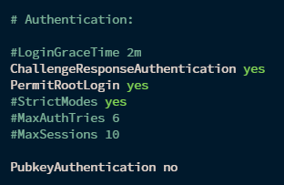
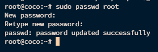

# How-To-install-Pterodactyl-In-Oracle-Cloud

Enabling SSH Password Authentication and Opening Ports in Ubuntu
This guide provides step-by-step instructions on how to enable SSH password authentication in Ubuntu and how to open ports using the firewall.

## Prerequisites
- A running instance of Ubuntu.
- Root or sudo access to the system.

### 1. Enabling SSH Password Authentication in Ubuntu
SSH password authentication is often disabled by default for security reasons. Follow these steps to enable it:

#### Step 1: Open the SSH Configuration File
Open the SSH configuration file in a text editor. You can use nano or any other text editor of your choice.

    sudo nano /etc/ssh/sshd_config

#### Step 2: Modify the Configuration File

Edit or modify the following lines:

    PasswordAuthentication yes 
    ChallengeResponseAuthentication yes #This line is to be added in the file if its not there.
    PubkeyAuthentication no 
    PermitRootLogin yes

* PasswordAuthentication yes: Enables password authentication.  
* ChallengeResponseAuthentication yes: Enables challenge-response authentication. 
* PubkeyAuthentication no: Disables public key authentication. 
* PermitRootLogin yes: Allows root login. 

#### Step 3: Save the File

Save the file and exit the text editor. 
- In nano, press Ctrl+O, Enter then Ctrl+X.

#### Step 4: Restarting SSH

### 2. Opening Ports in Ubuntu with firewalld
firewalld is a complete firewall solution that dynamically manages the trust level of network connections and interfaces. Follow these steps to open ports.

#### Step 1: Install firewalld
First, ensure that firewalld is installed:

    sudo apt update
    sudo apt install firewalld -y

#### Step 2: Start and Enable firewalld
Start firewalld and enable it to start at boot:

    sudo systemctl start firewalld
    sudo systemctl enable firewalld

#### Step 3: Allow SSH (Port 22)
To ensure you do not lock yourself out, allow SSH connections:

    sudo firewall-cmd --permanent --add-service=ssh #Port 22
    sudo firewall-cmd --reload #You need to reload after opening ever port

#### Step 4: Allow Other Ports For The Panel
Open the required ports by running the following commands:

    sudo firewall-cmd --zone=public --permanent --add-service=mysql
    firewall-cmd --zone=public --permanent --add-port=3306/tcp
    firewall-cmd --zone=public --permanent --add-port=8080/tcp
    firewall-cmd --zone=public --permanent --add-port=443/tcp
    firewall-cmd --zone=public --permanent --add-port=22/tcp
    firewall-cmd --zone=public --permanent --add-port=80/tcp
    firewall-cmd --zone=public --permanent --add-port=2022/tcp
    firewall-cmd --zone=public --permanent --add-port=22565/tcp
    firewall-cmd --reload

#### Step 5: Verify firewalld Status
Check the status of firewalld to ensure the rules are applied correctly:

    sudo firewall-cmd --list-all

### 2. Configure-SSH Root Password.
#### Step 1: Set Up Root Password

- If the root user does not have a password set or you wish to change it:

        sudo passwd root

Follow the prompts to set a new password for the root user and you need to enter the password twice also you can't see the password when you are typing it.

